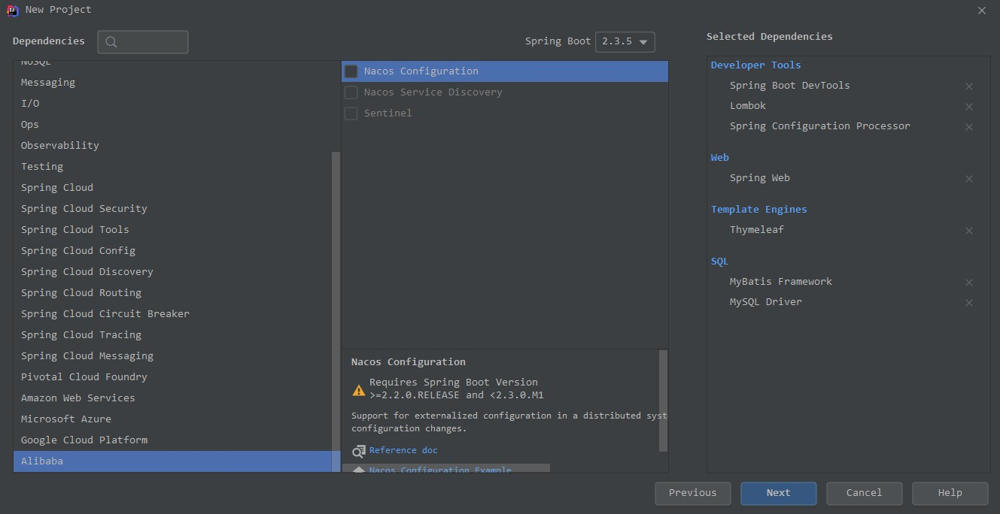
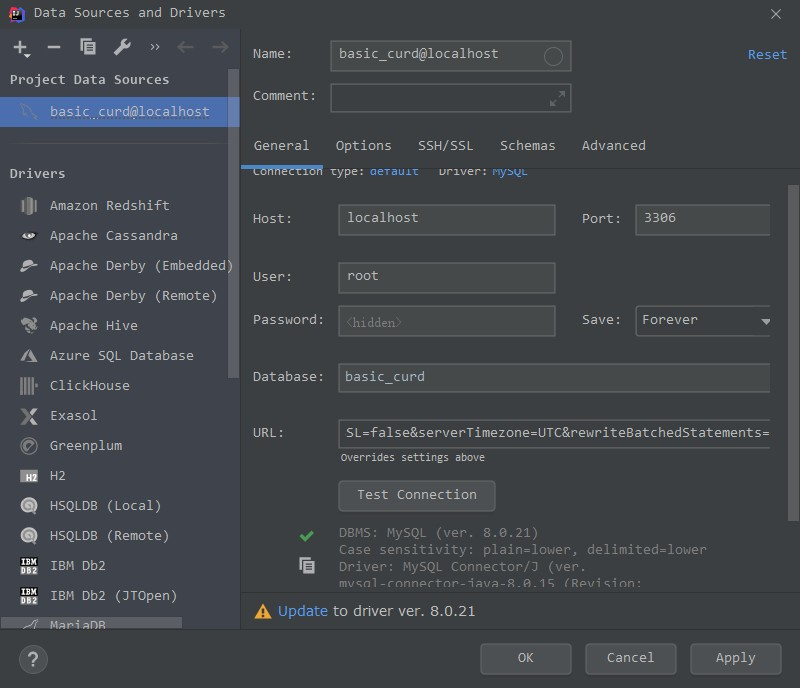

# spring-curd
基于springboot的简单CURD

## 1. 搭建项目框架

1. 初始化项目


2. 添加其他依赖
```xml
<!-- pom.xml -->
<dependencies>
        <!-- 使用faseJson解析json体 -->
        <dependency>
            <groupId>com.alibaba</groupId>
            <artifactId>fastjson</artifactId>
            <version>1.2.35</version>
        </dependency>

        <!-- swagger3.0-->
        <dependency>
            <groupId>io.springfox</groupId>
            <artifactId>springfox-boot-starter</artifactId>
            <version>3.0.0</version>
        </dependency>

        <!-- 分页插件-->
        <dependency>
            <groupId>com.github.pagehelper</groupId>
            <artifactId>pagehelper-spring-boot-starter</artifactId>
            <version>1.2.3</version>
        </dependency>
</dependencies>

<!--配置阿里云仓库-->
<repositories>
        <repository>
            <id>public</id>
            <name>aliyun nexus</name>
            <url>http://maven.aliyun.com/nexus/content/groups/public/</url>
            <releases>
                <enabled>true</enabled>
            </releases>
            <snapshots>
                <enabled>false</enabled>
            </snapshots>
        </repository>
 </repositories>
```

## 2. 配置服务器和数据库
```properties
# 程序运行端口
server.port=8099

# 系统属性及变量
spring.profiles.active=dev

#数据库
spring.datasource.url=jdbc:mysql://localhost:3306/basic_curd?serverTimezone=Asia/Shanghai
spring.datasource.username=root
spring.datasource.password=root123
spring.datasource.driver-class-name=com.mysql.cj.jdbc.Driver

# thymeleaf
spring.thymeleaf.check-template=false
spring.thymeleaf.check-template-location=false


# mybatis
#配置映射文件存放位置
mybatis.mapper-locations=classpath:mapper/*.xml

# 配置映射文件存放位置
mybatis-plus.mapper-locations=classpath:mapper/*.xml

```

## 3. 搭建数据库
1. 搭建一个basic_curd数据库，含有一张表 user(用户表)

```mysql
create table user
(
   id bigint(20) NOT NULL auto_increment comment '用户编号',
   username varchar(100) not null comment '用户名',
   password varchar(100) not null comment '密码',
   PRIMARY KEY (id)
) ENGINE =InnoDB AUTO_INCREMENT=5 DEFAULT CHARSET =utf8 COMMENT ='用户表';
```

2. 使用IDEA 自动的数据库管理工具进行连接尝试



```text
jdbc:mysql://localhost:3306/basic_curd?characterEncoding=utf8&useSSL=false&serverTimezone=UTC&rewriteBatchedStatements=true
```

## 4. 建立项目目录

```js
|-- java
	|....
		|-- curd
			|-- config // new
				|-- SwaggerConfig.java 
			|-- controller // new
				|-- UserController.java
            |-- dao // new
				|-- UserDao.java // interface
			|-- model	// new
				|-- UserModel
			|-- service // new
				|-- UserService.java
			|-- CurdApplication.java
|-- resources
	|-- application.properties
	|-- mapper // new
		|-- UserMap.xml
	|-- static
	|-- templates
```

##  5. 配置Swagger文档

```java
// config/SwaggerConfig.java

package com.yjp.curd.config;

import io.swagger.annotations.ApiOperation;
import org.springframework.context.annotation.Bean;
import org.springframework.context.annotation.Configuration;
import springfox.documentation.builders.ApiInfoBuilder;
import springfox.documentation.builders.PathSelectors;
import springfox.documentation.builders.RequestHandlerSelectors;
import springfox.documentation.service.ApiInfo;
import springfox.documentation.service.Contact;
import springfox.documentation.spi.DocumentationType;
import springfox.documentation.spring.web.plugins.Docket;

@Configuration
public class SwaggerConfig {
    @Bean
    public Docket api() {
        return new Docket(DocumentationType.OAS_30)
                .apiInfo(apiInfo())
                .select()// 选择那些路径和api会生成document
                .apis(RequestHandlerSelectors.withMethodAnnotation(ApiOperation.class))// 对所有api进行监控
                .paths(PathSelectors.any())
                .build();
    }

    private ApiInfo apiInfo() {
        return new ApiInfoBuilder()
                .title("基础CURD文档")
                .description("基础CURD接口文档")
                .version("1.0")
                .contact(new Contact("jingping.ye", "1104639669@qq.com", "1104639669@qq.com"))
                .build();
    }
}

```

在`CurdApplication.java`中配置：

```java
@SpringBootApplication
@EnableOpenApi  //swagger3.0
@MapperScan("com.yjp.curd.dao")
```

## 6.编写用户增删改查逻辑

SQL语句映射：`UserMap.xml`

```xml

<?xml version="1.0" encoding="UTF-8" ?>
<!DOCTYPE mapper
        PUBLIC "-//mybatis.org//DTD Mapper 3.0//EN"
        "http://mybatis.org/dtd/mybatis-3-mapper.dtd">

<mapper namespace="com.yjp.curd.dao.UserDao">
    <!-- 增-->
    <insert id="add" parameterType="com.yjp.curd.model.UserModel" useGeneratedKeys="true" keyProperty="id">
        INSERT INTO basic_curd.user(username, password) VALUES
        (#{username}, #{password})
    </insert>

    <!-- 批量增加 -->
    <insert id="addBatch" parameterType="java.util.List">
        insert into basic_curd.user (username, password) values
        <foreach collection="list" item="item" index="index" separator=",">
            (#{item.username,jdbcType=VARCHAR},
            #{item.password,jdbcType=VARCHAR})
        </foreach>
    </insert>

    <!-- 删 -->
    <delete id="del" parameterType="String">
        delete from basic_curd.user where id=#{id}
    </delete>

    <!-- 改 -->
    <update id="update" parameterType="com.yjp.curd.model.UserModel">
        update basic_curd.user set username=#{username}, password=#{password}
        where id = #{id}
    </update>

    <!-- 查列表-->
    <select id="getList" resultType="com.yjp.curd.model.UserModel">
        select * from basic_curd.user
    </select>

    <!-- 查详情 -->
    <select id="getUserById" resultType="Map">
        select * from basic_curd.user where id=#{id};
    </select>
</mapper>
```

模型层：`UserMode.java`

```java
package com.yjp.curd.model;

public class UserModel {
    private int id;
    private String username;
    private String password;

    public int getId(){
        return id;
    }

    public void setId(int id){
        this.id = id;
    }

    public String getUsername(){
        return username;
    }

    public void setUsername(String username){
        this.username = username;
    }

    public String getPassword(){
        return password;
    }

    public void setPassword(String password) {
        this.password = password;
    }
}
```

数据库查询层：`UserDao.java`

```java
package com.yjp.curd.dao;

import com.yjp.curd.model.UserModel;
import org.apache.ibatis.annotations.Mapper;

import java.util.List;
import java.util.Map;

@Mapper
public interface UserDao {
    //  增加
    int add(UserModel user);

    boolean addBatch(List<UserModel> userList);

    //  删除
    boolean del(String id);

    //  修改
    int update(UserModel user);

    //  查-列表
    List<UserDao> getList();

    Map<UserModel, Object> getUserById(Integer id);
}
```

业务处理层：`UserService.java`

```js
package com.yjp.curd.service;

import com.alibaba.fastjson.JSON;
import com.alibaba.fastjson.JSONObject;
import com.yjp.curd.dao.UserDao;
import com.yjp.curd.model.UserModel;
import org.springframework.beans.factory.annotation.Autowired;
import org.springframework.stereotype.Service;

import java.util.ArrayList;
import java.util.HashMap;
import java.util.List;
import java.util.Map;

@Service
public class UserService {
    @Autowired
    private UserDao userDao;


    public int add(String user) {
        //  提取用户输入信息
        JSONObject jsonObject = JSONObject.parseObject(user);
        String username = jsonObject.getString("username");
        String password = jsonObject.getString("password");

        //  注入实体 对象
        UserModel userModel = new UserModel();
        userModel.setUsername(username);
        userModel.setPassword(password);

        //  返回新增id
        if(userDao.add(userModel)>0){
            return userModel.getId();
        }else{
            return 0;
        }
    }

    public int addBatch(String userList){
        //  提取输入的用户信息

        List<UserModel> addUserlist = new ArrayList<>();

        List<HashMap> list = JSON.parseArray(userList, HashMap.class);
        for(Map<String, Object> userItem:list){
            String username = (String) userItem.get("username");
            String password = (String) userItem.get("password");

            UserModel userModel = new UserModel();
            userModel.setUsername(username);
            userModel.setPassword(password);

            addUserlist.add(userModel);
        }


        //  返回新增信息
        Boolean res = userDao.addBatch(addUserlist);

        if(res){
            return 1;
        }else{
            return 0;
        }

    }


    public boolean del(String args) {
        JSONObject jsonObject = JSONObject.parseObject(args);
        String id = jsonObject.getString("id");
        return userDao.del(id);
    }


    public int update(String user) {
        //  提取用户输入信息
        JSONObject jsonObject = JSONObject.parseObject(user);
        Integer id = Integer.valueOf(jsonObject.getString("id"));
        String username = jsonObject.getString("username");
        String password = jsonObject.getString("password");

        //  注入实体 对象
        UserModel userModel = new UserModel();
        userModel.setId(id);
        userModel.setUsername(username);
        userModel.setPassword(password);

        //  返回新增id
        if(userDao.update(userModel)>0){
            return userModel.getId();
        }else{
            return 0;
        }
    }

    public List<UserDao> getList() {
        return userDao.getList();
    }

    public Map<UserModel, Object> getUserById(String id){
        Integer _id = Integer.valueOf(id);
        Map<UserModel, Object> userInfo = userDao.getUserById(_id);
        return userInfo;
    }
}

```

接口控制层：`UserController.java`

```java
package com.yjp.curd.controller;

import com.yjp.curd.model.UserModel;
import com.yjp.curd.dao.UserDao;
import com.yjp.curd.service.UserService;
import io.swagger.annotations.Api;
import io.swagger.annotations.ApiOperation;
import org.springframework.beans.factory.annotation.Autowired;
import org.springframework.web.bind.annotation.*;

import java.util.HashMap;
import java.util.List;
import java.util.Map;

@Api(tags = "用户管理")
@RestController
@RequestMapping("/user")
public class UserController {
    @Autowired
    private UserService userService;

    @ApiOperation("增加用户")
    @RequestMapping(value="/add", method = RequestMethod.POST)
    public Object addUser(@RequestBody String user){
        Integer res = userService.add(user);
        Map map = new HashMap();
        if(res>0){
            map.put("code","4000");
            map.put("msg","新增成功");
            map.put("res", res);

        }else{
            map.put("code","4001");
            map.put("msg","新增失败");
        }
        return map;
    }

    @ApiOperation("批量增加用户")
    @RequestMapping(value="/add/batch", method = RequestMethod.POST)
    public Object addUserBatch(@RequestBody String userList){
        Integer res = userService.addBatch(userList);
        Map map = new HashMap();
        if(res>0){
            map.put("code","4000");
            map.put("msg","批量新增成功");
        }else {
            map.put("code","4001");
            map.put("msg","批量新增失败");
        }
        return map;
    }

    @ApiOperation("删除用户")
    @RequestMapping(value="/del", method = RequestMethod.DELETE)
    public String delUser(@RequestBody String args){
        if(userService.del(args)){
            return "删除成功";
        }else{
            return "删除失败！";
        }
    }

    @ApiOperation("修改用户")
    @RequestMapping(value="/update", method = RequestMethod.PUT)
    public Object updateUser(@RequestBody String user){
        Integer res = userService.update(user);
        Map map = new HashMap();
        if(res >0){
            map.put("code","4000");
            map.put("msg","修改成功");
            map.put("res", res);
        }else{
            map.put("code","4001");
            map.put("msg","修改失败");
        }
        return map;
    }

    @ApiOperation("查询用户列表")
    @RequestMapping(value="/list", method = RequestMethod.GET)
    public List<UserDao> getList(){
        return userService.getList();
    }

    @ApiOperation("查询用户详情")
    @RequestMapping(value="/detail", method = RequestMethod.GET)
    public Map<UserModel, Object> getUserById(@RequestParam String id){
        return userService.getUserById(id);
    }
}

```

## 7. 启动

至此，项目完毕。

在地址栏中输入：

```text
http://localhost:8890/swagger-ui/index.html#/
```

可以访问到接口。